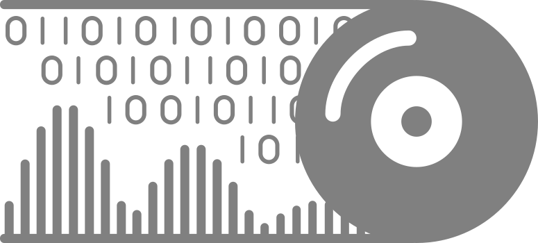

  
  

# ZLSplitter

ZLSplitter is a splitter plugin.

A short intro video is available at [here](https://www.youtube.com/watch?v=-RVm9mbbQtA).

## Usage

See the [manual](https://zl-audio.github.io/plugins/zlsplitter/) for details.

## Download

See the releases for the latest version. 

**Please NOTICE**:
- the installer has **NOT** been notarized/EV certificated on macOS/Windows
- the plugin has **NOT** been fully tested on DAWs

## Build from Source

0. `git clone` this repo

1. [Download CMAKE](https://cmake.org/download/) if you do not have it.

2. Populate all submodules by running `git submodule update --init` in your repository directory.

3. Follow the [JUCE CMake API](https://github.com/juce-framework/JUCE/blob/master/docs/CMake%20API.md) to build the source.

For more details, please refer to the corresponding [Github action workflows](.github/workflows/cmake_release.yml).

## License

ZLSplitter is licensed under AGPLv3, as found in the [LICENSE.md](LICENSE.md) file.

Copyright (c) 2024 - [zsliu98](https://github.com/zsliu98)

JUCE framework from [JUCE](https://github.com/juce-framework/JUCE)

JUCE template from [pamplejuce](https://github.com/sudara/pamplejuce)

[fft-juce](https://github.com/hollance/fft-juce) by [
Matthijs Hollemans](https://github.com/hollance)

[median-filter](https://github.com/suomela/median-filter) by [suomela](https://github.com/suomela)

[Friz](https://github.com/bgporter/animator) by [bgporter](https://github.com/bgporter)

[RemixIcon](https://github.com/Remix-Design/RemixIcon) by [Remix Design](https://github.com/Remix-Design)

Font from CMU Open Sans, Font Awesome and MiSans.

## References

Vicanek, Martin. *A New Reverse IIR Filtering Algorithm*. (2022).

Redmon, Nigel. *Cascading filters*. (2016).

Fitzgerald, Derry. *Harmonic/percussive separation using median filtering*. (2010).
